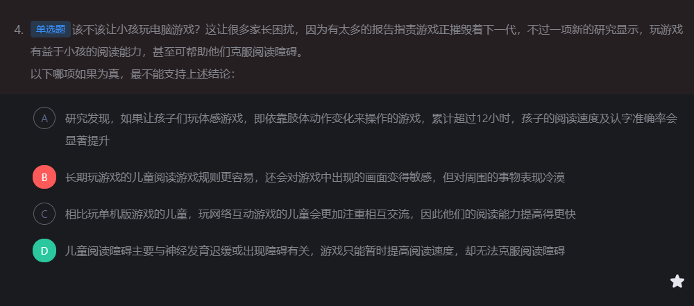
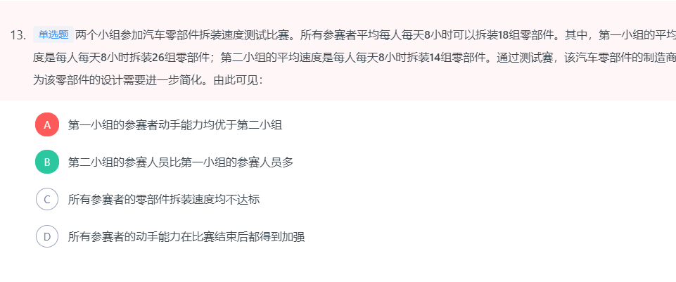
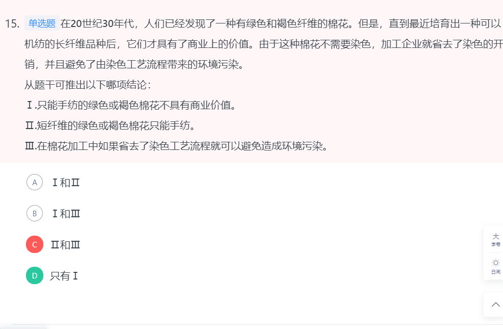
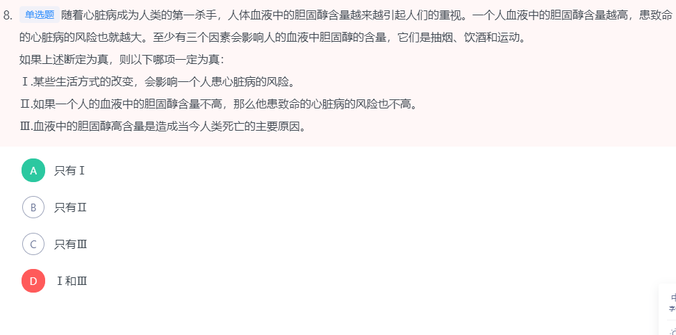

# 判断推理

## 逻辑判断

### 加强题型

#### 必要条件

**否定代入**

- 否定A项代入，即目前蔬菜栽培使用的农药主要不是用于消除虫害，则即使将该研究成果应用到蔬菜栽培方面，也不能大大减少农药的使用量，否定选项后论点不成立，为题干应该补充的必要前提，A项当选。

- 否定D选项代入，**目前我国**的现行法律是不允许种植转基因蔬菜的，题干中的论述为“如果把这一项研究成果应用到蔬菜栽培方面，可大大减少农药的使用量”，**即题干只是一种假设**，D选项只是否定**论点中的前提，否前并不能推知确定性答案**，据此D选项错误。

  故正确答案为A。

-  C 医药费用增长过快，不是必要条件，能加强，补充论据

-  **D  假如有医保了，就分担了80%，就没有了负担了。没他不行。**

提高计程车收入。

B项：上述8位员工在离职后的两年内只能从事饮品行业的工作，如果这些员工可以从事别的类型的工作，那么就不会失去就业机会，因此该项是题干结论能够成立的必要条件，可以加强，当选

A项：如果大陆架不会随着地球地壳的移动而持续着缓慢但永不停息的变化，那么海洋就不能由陆地转化而成，论点也就无法成立，选项为论点成立的必要条件，可以加强，当选；

​		

A项：中西医可以结合是开展治疗的前提，是结论成立的一个必要条件，当选；

C项：该项说的是数学学习机性能的改善，对提高学生数学成绩的作用越来越明显，是补充论据，有一定的加强作用，保留；

D项：如果拥有数学学习机却不使用，就不可能出现数学学习机提高数学成绩的情况，所以该项是论点成立的必要条件，可以加强，保留。

对比C、D，C项是补充论据支持，D项是论点成立的必要条件，因此D项力度更强

B项，可乐不需要冷藏而牛奶需要，与观点中包装盒的设计无关。不构成观点的前提条件，排除。

C项，产品的包装设计以实用为主要目的。牛奶储存，方盒是为了冷藏柜中可以摆放更多的牛奶，可乐瓶圆形是为了让人们更容易随手拿取和携带。这些都是根据实际使用时的需求而设计的。可以构成观点正确的前提，当选。

A项：题干中认为学前儿童的思维判断存在问题。要使题干论断成立，则须假设与之相对的成年人对思维判断是正确的，故A项为正确答案，当选；

B项：提及学前儿童判断能力不成熟和稳定是通过整个文段能够得到的一种结论，而并非支持论点成立的一种理由，因此，无法支持，排除；

C项，强调法治和德治在协调对象等方面有所不同，正因为有所不同，才需要将两者结合来应用，即正是因为C项这一前提才产生了题干的论点，正确；

D项，强调法治和德治结合会带来社会稳定，与题干中是否需要将两者扬弃和改造无关，错误。

B项：根据题干前两句话可知“小麦黄叶病”无需定期筛查和预防是因为一旦光照充足就不会影响产量，而“小麦锈病”需要定期筛查和预防就要求该病不能具有“小麦黄叶病”这一特性，即“小麦锈病”产生的危害应与阳光是否充足无关，如果“小麦锈病”的危害与阳光不充足有关，那么光照充足后该病很可能会与“小麦黄叶病”一样对产量无影响，也就无需定期筛查和预防“小麦锈病”，即选项不成立论点不成立，因此该项是论点成立的必要条件，当选；

D项只有欧洲市场在全球笔记本市场中占较大比例，用欧洲市场的调查数据来说明全球市场的问题才具有说服力。

A项只是讲述含胶原蛋白的护肤品受欢迎的现象，没有提及富士公司胶片技术，与结论无关；B项不是得出结论必须具备的前提假设，假如富士公司不具备生产能力，会有其他具备生产能力的厂家进行生产，关键前提仍在于胶片技术能够用于生产护肤品，B项为强干扰项；C项没有说明护肤产品与胶片技术的关系，属无关选项；D项符合题意，只有护肤产品能利用富士公司生产胶卷使用的科研成果和工艺，才能生产相关的消费品，才能使爱美人士受益。

故正确答案为D

#### 加强选非题

- B项“但”之前解释了为什么玩游戏能够提高小孩的阅读能力，说明玩游戏确实对阅读有帮助，“但”之后与题干讨论无关，整体上来讲属于可加强选项，排除；
- D项表明阅读障碍主要与神经发育迟缓有关，同时否定了游戏能够克服阅读障碍，属于削弱。题干需选择不能支持的选项，当选。

- C项：选项说明该计算模型如果与其他天气预报模型结合，能有效预测出的恶劣天气事件，但是有效地预测情况是否为该计算模型的作用，不能确定，不是上述结论的必要前提，当选；
- D项：论点是通过检测气旋的形成来预测恶劣天气的，选项说气旋的形成可导致恶劣天气，是上述结论的必要前提，排除。

​		题干讨论的是产量，B讨论的是质量。属于话题不一致。

C强调逃避面对现实是抑郁的特征之一，而题干论点讨论的是换抑郁症的原因，话题不一样，无法加强。

- B 项：雷帕霉素在延缓衰老的同时，使人更易受到细菌和病毒的侵袭，前半句说明雷帕霉素可以延缓衰老，但后半句表述的“使人更易受到细菌和病毒的侵袭”说明雷帕霉素并不是可靠的抗衰老药物，削弱题干论点，不能支持，当选。
- C 项：实验研究已经证明雷帕霉素能够延长酵母、蠕虫和果蝇的寿命，通过举例子的方式加强题干的观点，排除。

A项储电量大、B项使用次数多、C项可以无线充电、D项充电耗电少均是对于论点的支持，故要比较强弱。其中C项只是说针对汽车会带来便利，范围较其他三项小了很多，最不能支持论点。

产量和输入不能画等号。

D项：主要通过邮局订购，这是在客观阐释报刊亭报刊销售量占本地报刊销售量的比例问题，剩下的不通过邮局订购而通过路边报刊亭购买的数量并不明确，为不明确选项，不能作为拆除报亭的理由，当选

C项：说的是睡眠时间与睡眠质量、睡眠习惯之间的关系，是否会影响到学习成绩不确定，因此无法加强，当选；

A项：题干小鼠都是先养成过度肥胖，然后分组，一组一直胖，一组瘦胖循环，**A项这里的过度肥胖不明确说的是哪组小鼠的情况**，不能加强，当选；

D项：如果打破的菌群会自行恢复，那其体内的黄酮类化合物就不会被破坏，小鼠体重就不会增加，故D选项为论点成立的必要条件，排除。

### 翻译推理

#### 日常结论

- A项：根据“涉及传统文化领域的表述面临两类尴尬：满足于传统的经验式表述，很难融入现当代语境，仿佛以文言文应对现代社会之沟通”，可以推出“传统经验式表述很难在现当代语境中广泛传播书法之美”，当选；
- B项：题干只是说借助西方理论解读书法近于隔靴搔痒，也就是说很难解读，而不是无法解读，该项不能推出，排除；
- C项：题干说的是借助西方美学解读传统书法颇似用传统心态解读西方文明，说的是两者相似，而不是前者是后者的表现，该项不能推出，排除；
- D项：根据“涉及传统文化领域的表述面临两类尴尬”可知，该种尴尬并非只针对书法，其他传统文化也可能存在类似的尴尬，该项不能推出，排除。

​        故正确答案为A。

- A项：由题干最后两句可得出，当选；

- B项：题干说“柠烯本身并不可怕，因为该化学物质对人体不会形成大的危害，事实上，它可被用于食品的调味剂”，因此B选项排除；

- C项：题干只说当柠烯暴露于普遍存在于空气中的臭氧中时会形成甲醇，无中生有，排除；肯后没有必然结论

- D项：题干只是说柠烯喷入空气中可能有害，并非所有含有该成分的物品都有害，无中生有，排除。
- 故正确答案为A。

活的菌的实验结果没有说。

​	大多数都也绝对化

B先反思对方的错误，跳过了一步.

**日常结论解题思路**

B项：题干中指出开发的工具可以识别和探测深度造假，只是说明针对“深度造假”现象，技术进步可以解决，但没有提及我们是否只能依靠技术进步才能解决“深度造假”现象，逻辑错误，排除； 强加逻辑关系。

有的老年人-> 不适合投资

-鉴别 -> 受骗

(14x + 26y)/(x+y) = 18 x:y = 1:2

B项：题干中说“友谊只存在于好人之间”，因此坏人之间不存在友谊，可以推出，当选；

C项：题干中说“友谊只存在于好人之间”，但没有说好人之间一定存在友谊，无法推出，排除；

C项：由第一份资料可知马六最晚在1992年就开始占道经营，又从第二份资料知道他已经占道经营10年时间，那么第二份资料最晚是在2002年写下的，可以得到其书写早于2005年，可以推出，当选

极值推测法。

A 时间先后反

B 调节不是必然(太绝对)

C项：题干以“更注重在家辅导的投入”和“参与社区及学校活动的投入较欠缺”，说明了两种不同的投入的关系为一者变多、随之另外一者减少，即对在家辅导的投入越多，就会使得对子女参与社区及学校活动的投入越少，二者存在反比关系，当选；

D项：题干中生活应该是一系列冒险，是通向不可预知的未来旅行，不是能事先拥有的，即文段意在强调生活的冒险性、不可预知性、未知性，选项“假如我知道写诗的结果，我就不会开始写诗”由于不知道写诗的结果，所以才有了写诗的动力，也是在强调一种未知性、不可预知性，与题干的主旨内容相同，可以推出，当选。

故正确答案为D。

- A项：由题干第一句可知，海豚是体型较小的鲸类，而非体型较小的哺乳动物，排除；

  

- A项：题干只是表述货币持续贬值“可能”会导致资产价格全面下跌，而该项说“会”导致，说的过于绝对，无法推出，排除；

- C项：题干最后一句表明我们不允许出现这种情况，“这种情况”指代的是前文“如果央行允许人民币继续贬值”这种情况，该项属于最后一句的同义替换，可以推出，当选；

  

- C项：根据第三句话可知，新研发的补牙填充物可以刺激牙髓中干细胞的生长，修复受损部位，可以推出新研发的补牙填充物能刺激受损牙齿自愈，当选；
- D项：根据第四句话可知，新研发的补牙填充物可以刺激干细胞的增殖，并分化成牙本质，但并不是促进牙本质的生长，“分化”并不意味着“促进生长”，偷换概念，排除。

A项：题干并没有提及区块链技术的掌握者，属于无中生有，无法推出，排除；

B项：题干并没有提及区块链技术的掌握者，属于无中生有，无法推出，排除； 

B项：丑是美的反面，两者之间是对立存在的，即缺少任何一个，另一个都无法存在，因此可以推出没有美也就没有丑，当选；

- C 项：选项讨论的是导致该市人口死亡的主要疾病发病率和其治疗水平的关系，与题干主题不一致，无中生有，排除。
- D 项：由“该市恶性肿瘤的总体发病率和死亡率也逐年上升，目前已相当于欧美等发达国家和地区的2/3 ～ 3/4”可知，该市恶性肿瘤的总体发病率和死亡率其实比欧美等发达国家和地区低，能推出，当选

A 还存在其他东西影响。

B项：题干说到阳光辐射、空气污染等环境因素会使人体产生更多活性氧自由基，抗氧化剂可以有效清除多余自由基，而活性氧自由基是人类衰老的根源，所以二者可以影响人的衰老速度，可以推出，当选

D项：题干中没有涉及到快递企业快递员的收入问题，无中生有，排除。

A项：根据题干第二句话可知，该国的快递员并没有为特色快递企业工作的强烈愿望，说明该国的非特色快递企业收费单价并没有大幅降低，再结合题干第一句话可知，快递企业既然没有大幅下调收费单价，说明该国快递市场竞争并不激烈，可以推出，当选。

**刘易斯拐点意味着剩余劳动力被吸收完，说明劳动力会出现短缺，当选；**

少数被调查者认为社会上大多数人可信。

被调查者！= 社会上 AB错误。

本题考查原因解释。题干中存在的矛盾是“君主的长子拥有绝对的王位继承优先权。”与“现任女王在内，英国历史上有很多女王都继承了王位。”选项中A、B、D项都可以成为矛盾的原因，而C项无法成为这种矛盾的原因。C项支持了后者，否定了前者，所以选C。

本题为选非题，故正确答案为C。

根据“直到最近培育出一种可以机纺的长纤维品种后，它们才具有了商业上的价值。”可知“只能手纺的绿色或褐色棉花不具有商业价值。”Ⅰ正确。

“短纤维的绿色或褐色棉花只能手纺”无法推出，不确定是否有别的方式，Ⅱ错误。

“在棉花加工中如果省去了染色工艺流程就可以避免造成环境污染”过于绝对，无法确定棉花加工过程中是否有其他污染产生，Ⅲ错误。因此只有I是正确的。

故正确答案为D。

- A项题干只说需要彻底改变浪费陋习，没有说明改变浪费陋习是否很难，A项无法推出；
- B项从题干第二句话浪费是应该被彻底改变的生活陋习可知，浪费是不应该出现的现象，B项可以推出；
- C项由第二句可知，浪费跟经济发展、生活富裕无关，C项无法得出；
- D项由第一句可知，浪费意味着我们的劳动和创造全部或部分做了无用功（翻译为“浪费⇒我们的全部或部分劳动和创造做了无用功”），D中“我们的部分劳动打了水漂”是肯定第一句中的后件，肯定后件不能推出任何绝对表达的结论，因此D项错误。
- 故正确答案为B。

- B项：题干中指出原始人类能够通过一直追逐、耗尽羚羊体能的方法来捕获羚羊，说明原始人类在耐力上是优于羚羊的，可以推出，当选；
- D项：题干中并没有提及原始人类和羚羊在奔跑中的体能消耗，无法进行比较，因此无法推出，排除

- B项：题干只是说其中40不可能是实际发生过的事情，**但剩下的60不能确定是否实际发生，无中生有，排除**；
- D项：根据第一句可知，的确有一部分人可以描述自己早期的家庭情景，又根据最后一句可知，这些记忆都是人们根据家庭照片和他人叙述而虚构出来的，所以能够推出，有些人可以通过家庭照片和他人叙述描述自己**早期的家庭情景，当选。**

- B项：题干说月球正逐渐离地球远去，而农历正是月球绕地球一周的天数。

  说明月球在远离我们而去，那么月球绕地球运行的轨道也因此变长，绕地球运行一周需要的时间也会变得更长，我们的一个月也就变长了。所以可以推出鹦鹉螺的波状生长线隔会越长越宽，可以推出，当选；

- D项：生长线数随着化石年代的上溯而逐渐减少，题干中没有提及化石年代的上溯，无中生有，排除。

  

- A项：根据第一句可知，中西部地区重大群体事件的频发是因为普遍低价征地引起的，不是因为征地，偷换概念，排除；
- B项：根据最后一句可知，国家主导型市场经济模式自身存在的问题和矛盾，可推出中国市场经济模式是国家主导型市场经济模式，可以推出，当选

- B项：题干指出牛顿、达尔文和高尔基三人小时候成绩差或智力低下，但是长大后成就很大，可以推出人的才能表现有早晚之别，可以推出，当选；

- C项：没有提及成就与所受教育的多少的关系，无中生有，无法推出，排除；

  

- A项：“富营养化导致植物过度生长”说明对植物繁衍生长是有害的，排除；

- B项：人类不合理的活动也会导致富营养化，“跟人类活动无关”说法错误，排除；

- C项：对环境的污染也会增加植物的养分供应量大量增加，会加速富营养化过程，当选；

- D项：富营养化可能是人类活动造成，也可能是自然形成，“完全”表述过于绝对，排除。

- 故正确答案为C。

  

  总共引进30种。题干①金融类12种，②非金融英文类10种，③美国引进非金融类7种，④美国以外非英文类9种。①+②+③+④=38，说明这里必有8种重合。任意两类的重合情况都不可能超过8种。

  B、D两项都超过了8种，排除；

  A项的集合概念“从美国引进的、非英文的金融类教材”题干中没有提到，排除；

  C项是1和4的组合，符合题意，是正确答案，当选。

  故正确答案为C。

根据题干所给的信息，甲的心率是，甲的心电图两个波峰的间隔为25mm，每分钟跳动60次，那么心电图纸每秒的移动速度为：。乙的心电图两个波峰的间隔为20mm，则乙的心率为：。乙的心率为。

故正确答案为C。

A项：文学作品优劣并未在题干中体现，排除；

B项：题干中莫言获奖后作品畅销，深受国内外读者追捧，由此推出B项，B项为正确答案，当选；

C项：魔幻现实主义并非莫言作品深受国内外读者追捧的原因，不能从题干中推出，排除；

D项：题干中并未提及外国作家，排除。

故正确答案为B。

A项，体现出主人倾向于禁止吸烟，错误；

B项，主人的思想混乱，不能说主人做出两种相反的行为就说主人的思想混乱，错误；

C项，体现出了没有更倾向于哪一个，正确；

D项，体现出主人倾向于允许吸烟，错误。

故正确答案为C。

A项是原文的复述，可以根据“它是人体维持正常运转所需的微量元素”得到，为正确选项；

B项与文章的最后一句话有关，但原文说的是吸收入人体的铝无法排出容易患病，无法从文中得到该病是否由于“过量摄入”铝造成，因此错误，排除；

C项错误，原文说的是红烧肉不能放在铝锅里过夜，排除；

D项在原文中没有体现，属于无中生有，排除。

故正确答案为A。

- A项：题干并没有将关心孩子和满足孩子物质欲望进行对比，从而说明哪种快乐更多，无中生有，排除；
- D项：题干上半段是在说父母“用金钱砸下的抢跑来让孩子赢在起跑线上”，下半段是在说孩子需要陪伴，能够看出来孩子希望得到的爱和父母现在所给的并不一致，可以推出，当选。

故正确答案为D

从第一步信息可知，人们更喜欢壁画的原样，即便壁画的颜色和人物轮廓已不如从前，但人们可从中获得更多感受，即D项。

A项错误，题干的两个例子意在强调资本密集，并没有突出高科技对经济发展的作用；

D项通过诗人不认同对诗歌的普适定义这一点可以得到，只有D项是对题干信息的总结。

故正确答案为D。

III项说胆固醇含量高是人类死亡的主要原因，题干中讲的是心脏病，而不是胆固醇，偷换概念，排除。

由题干可知，“用水超标家庭”实际上指的是全部家庭中，用水量排名前30%的家庭。由于其他家庭的具体用水量未知，因此该地区平均的日均耗水量也无法确定，用水超标家庭不一定都超过了平均的日均耗水量，①错误；

超标用水家庭的认定是有一个固定比例的，数量的增加，必然是整体基数有所增加，因此不超标家庭的数量也逐年增多，③正确；整体上家庭数量增多，但无法确定日均耗水量的变化，因此无从得知用水总量是否增加，②错误。

第二步：结合分析，得出答案。

C项：根据题干可知，拟菌病毒会寄生于变形虫体内。被这种病毒寄生的变形虫会在哺乳类动物体内释放某种刺激物，但是没有拟菌病毒寄生的情况下会不会产生呼吸困难的刺激物无法得知，不能推出，排除；

A项：呼吸正常的哺乳动物体内不可能发现刺激物，根据题干中最后一句话：目前在临床中发现有呼吸困难症状的动物体内都能找到拟菌病毒，即间接表明了呼吸正常的动物体内不存在这种拟菌病毒，也就不会发现这种刺激物，可以推出，当选；

第一步：抓住题干主要信息。

题干主要说的是有人发现了外星人造访地球。

第二步：逐一判断选项。

发现外星人则外星人一定存在，A项错误；

题干没有提到有没有痕迹，B项错误；

题干并没有提到地球是否适应外星人生存，C项错误；

有人发现了外星人造访地球则外星人一定要进入宇宙空间，并向外探索，D项正确。

故正确答案为D。

A项：货物一定不是直接从德国空运过来的，因为欧洲没有这种白蚁，因此可以推出；

B项：题干中没提到台湾乳白蚁是台湾特有，所以不能推出，B错误；

C项：白蚁繁殖速度，题干中没有说明在中国境内到底呆了多久，不能因为数量多就说明繁殖速度快，也有可能是货物在境内时间长导致数量多，C错误；

第一步：抓住每句话中的对象及其关系。

题干中老师提到的所有对象均没有关系，这些对象包括奥数竞赛、英语口语、舞蹈比赛、女同学。

第二步：判断整体关系。

由于对象之间并没有关系，所以对于这些对象之间关系的推测只能是可能，不能是一定。

第三步：逐一判断选项的作用。

A、B、C全是肯定性的表述，只有D是可能性的表述。

故正确答案为D。

B项中气候的变化并不一定带来物种的变化，由第一步中第二点可知只有三种因素的变化才可能带来物种的变化，因此可以推出，当选；

由题干信息可知，B的速度比A、C快。假设A、B、C三人一起出发，当B到途中凉亭时，A落后B1公里；接着B又走了1公里，C到了凉亭；而A的速度比B慢，所以走的路程必定小于1公里，即没有到达凉亭，因此C比A先到达凉亭。

故正确答案为C。

第一点说明甲一半路程步行，一半路程跑步，第二点说明乙一半时间步行，一半时间跑步，第三点说明两人步行、跑步的速度均相同。

第二步：分析题干信息，并结合选项得出答案。

跑步比走路快，乙用一半的时间跑步，则跑步经过的路程占总路程的一半以上。图书馆到教室的总路程是一定的，甲一半的路程跑步，而乙一半以上的路程在跑步，因此乙用的时间较短，先到教室。

故正确答案为B。

不能得出

第一步：抓住题干主要信息。

停车可以拉下紧急制动开关，擅动紧急制动开关将负法律责任，属于警告范围。

第二步：根据题干信息逐一分析情况。

情况Ⅰ，无故使用或误用紧急制动开关，属于擅动紧急制动开关，符合警告标志的内容；

情况Ⅱ，特殊情况下，可能有乘客需要使运行的列车停下，属于停车可以拉下紧急制动开关，符合警告标志的内容。所以情况Ⅰ和Ⅱ都适用。

故正确答案为C。

